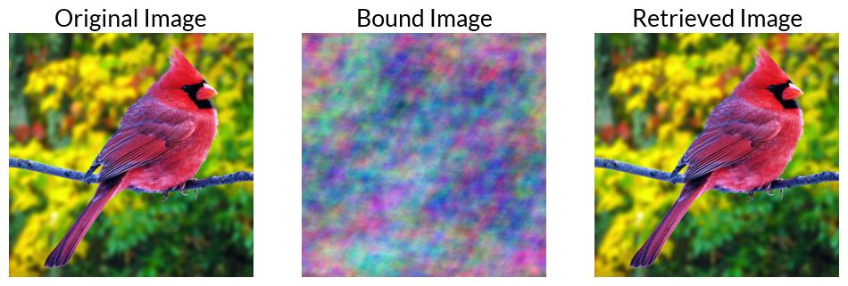

## Holographic Reduced Representations 🔥

[](https://github.com/MahmudulAlam/Holographic-Reduced-Representations/issues)
[](https://github.com/MahmudulAlam/Holographic-Reduced-Representations/network)
[](https://github.com/MahmudulAlam/Holographic-Reduced-Representations/stargazers)
[](https://github.com/MahmudulAlam/Holographic-Reduced-Representations/blob/main/LICENSE)
[]()
[](https://twitter.com/intent/tweet?text=Wow:&url=https%3A%2F%2Fgithub.com%2FMahmudulAlam%2FHolographic-Reduced-Representations%2F)

<p align="center"><b><em>Supports</em></b></p> 
<p align="center">
  
&nbsp;
  
&nbsp;
  
&nbsp;
  
</p>

## Install 🎉

```
pip install hrr
```

<!-- <b>else</b>
``` 
pip install git+https://github.com/MahmudulAlam/Holographic-Reduced-Representations.git
``` -->

## Update :hammer_and_wrench:

- v1.1.0 - ```dim/axis``` support for PyTorch, JAX & Flax
- For TensorFlow binding/unbinding can only be applied to the last dimension

## Intro :studio_microphone:

<p align="justify">
Holographic Reduced Representations (HRR) is a method of representing compositional structures using circular convolution in distributed representations. The HRR operations <em>binding</em> and <em>unbinding</em> allow assigning abstract concepts to arbitrary numerical vectors. Given vectors x and y in a d-dimensional space, both can be combined using binding operation. Likewise, one of the vectors can be retrieved knowing one of the two vectors using unbinding operation.
</p>

## Docs :green_book:

HRR library supports <a href="https://www.tensorflow.org">TensorFlow</a>, <a href="https://pytorch.org">PyTorch</a>
, <a href="https://github.com/google/jax">JAX</a>, and <a href="https://github.com/google/flax">Flax</a>. To import the
HRR package with the TensorFlow backend use ```HRR.with_tensorflow```, to import with the JAX backend
use ```HRR.with_jax```, and so on. Vectors are sampled from a normal distribution with zero mean and the variance of the
inverse of the dimension using ```normal``` function, with ```projection``` onto the ball of complex unit magnitude, to
enforce that the inverse will be numerically stable during unbinding, proposed
in [Learning with Holographic Reduced Representations](https://arxiv.org/abs/2109.02157).

```python 
from HRR.with_pytorch import normal, projection, binding, unbinding, cosine_similarity


batch = 32
features = 256

x = projection(normal(shape=(batch, features), seed=0), dim=-1)
y = projection(normal(shape=(batch, features), seed=1), dim=-1)

b = binding(x, y, dim=-1)
y_prime = unbinding(b, x, dim=-1)

score = cosine_similarity(y, y_prime, dim=-1, keepdim=False)
print('score:', score[0])
# prints score: tensor(1.0000)
```

What makes HRR more interesting is that multiple vectors can be combined by element-wise addition of the vectors,
however, retrieval accuracy will decrease.

```python
x = projection(normal(shape=(batch, features), seed=0), dim=-1)
y = projection(normal(shape=(batch, features), seed=1), dim=-1)
w = projection(normal(shape=(batch, features), seed=2), dim=-1)
z = projection(normal(shape=(batch, features), seed=3), dim=-1)

b = binding(x, y, dim=-1) + binding(w, z, dim=-1)
y_prime = unbinding(b, x, dim=-1)

score = cosine_similarity(y, y_prime, dim=-1, keepdim=False)
print('score:', score[0])
# prints score: tensor(0.7483)
```

More interestingly, vectors can be combined and retrieved in hierarchical order. 🌳

```
x    y
 \  /
  \/
b=x#y  z 
   \  /
    \/
 c=(x#y)#z
```

```python 
x = projection(normal(shape=(batch, features), seed=0), dim=-1)
y = projection(normal(shape=(batch, features), seed=1), dim=-1)
z = projection(normal(shape=(batch, features), seed=2), dim=-1)

b = binding(x, y, dim=-1)
c = binding(b, z, dim=-1)

b_ = unbinding(c, z, dim=-1)
y_ = unbinding(b_, x, dim=-1)

score = cosine_similarity(y, y_, dim=-1)
print('score:', score[0])
# prints score: tensor(1.0000)
```

## Flax Module (Fastest) ⚡

HRR package supports vector binding/unbinding as a Flax module. Like any other Flax module, this needs to be initialized
first and then execute using the apply method.

```python
x = normal(shape=(batch, features), seed=0)
y = normal(shape=(batch, features), seed=1)


class Model(nn.Module):
    def setup(self):
        self.binding = Binding()
        self.unbinding = Unbinding()
        self.projection = Projection()
        self.similarity = CosineSimilarity()

    @nn.compact
    def __call__(self, x, y, axis):
        x = self.projection(x, axis=axis)
        y = self.projection(y, axis=axis)

        b = self.binding(x, y, axis=axis)
        y_ = self.unbinding(b, x, axis=axis)

        return self.similarity(y, y_, axis=axis, keepdims=False)


model = Model()
init_value = {'x': np.ones_like(x), 'y': np.ones_like(y), 'axis': -1}
var = model.init(jax.random.PRNGKey(0), **init_value)

tic = time.time()
inputs = {'x': x, 'y': y, 'axis': -1}
score = model.apply(var, **inputs)
toc = time.time()

print(score)
print(f'score: {score[0]:.2f}')
print(f'Total time: {toc - tic:.4f}s')
# prints score: 1.00
# Total time: 0.0088s
```

## Processing :framed_picture:

```apply.py``` shows an example of how to apply binding/unbinding to an image. The bound image is the composite representation of the original image and another matrix sampled from a normal distribution performed by the ```binding``` operation. By using the ```unbinding``` operation original image can be retrieved without any loss. 

<p align="center">
  
</p>

## Papers :scroll:

[```Deploying Convolutional Networks on Untrusted Platforms Using 2D Holographic Reduced Representations @ ICML 2022```](http://arxiv.org/abs/2206.05893) [```GitHub```](https://github.com/NeuromorphicComputationResearchProgram/Connectionist-Symbolic-Pseudo-Secrets)

```bibtex 
@inproceedings{Alam2022,
  archivePrefix = {arXiv},
  arxivId = {2206.05893},
  author = {Alam, Mohammad Mahmudul and Raff, Edward and Oates, Tim and Holt, James},
  booktitle = {International Conference on Machine Learning},
  eprint = {2206.05893},
  title = {{Deploying Convolutional Networks on Untrusted Platforms Using 2D Holographic Reduced Representations}},
  url = {http://arxiv.org/abs/2206.05893},
  year = {2022}
}
``` 

## Report 🐛🚩🚧📢

To report a bug or any other questions, please feel free to open an issue.


## Thanks :blossom:

Thanks
to [](https://twitter.com/EdwardRaffML)
and
[](https://twitter.com/oatesbag)
for their constant support in this research endeavor.
